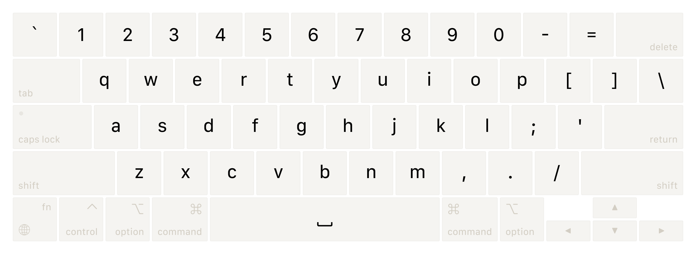
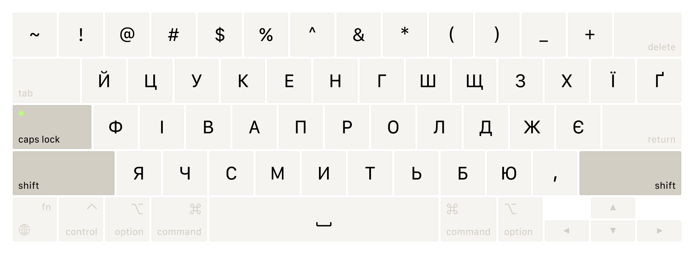

# UABC
Custom keyboard layout combining Ukrainian and English with Caps Lock language switching for macOS. Created with [Ukelele](https://software.sil.org/ukelele).


<details>
<summary>&nbsp;🟡&nbsp; Preview layers</summary>






</details>

## Features
* Language indication via Caps Lock LED — instantly know which language you're using.
* English ABC used as the base layout.
* Consistent `Shift + Number` symbol mapping across both languages.
* Latin symbols that overlap with Cyrillic letters are accessible via `Option + Key` and `Shift + Option + Key` combinations, except for `,` `.` `/` which follow special rules to maintain a familiar Cyrillic layout.
* Enhanced with typography and development-specific symbols.

## Installation
1. Download `UABC-X.X.zip` and extract its contents.
2. Move `UABC-X.X.bundle` to one of these locations:
<br />    `~/Library/Keyboard Layouts` for current user, recommended;
<br />    `/Library/Keyboard Layouts` for all users, macOS Sierra or earlier.
3. Open `System Settings > Keyboard > Input Sources`, press `+` button and add UABC from English section.
4. You might need to log out and back in for the layout to work properly.

## Usage Tips
1. To eliminate Caps Lock delay, install [CapsLockNoDelay](https://github.com/gkpln3/CapsLockNoDelay).
2. To remove blue cursor indicator, run the command below in the terminal and reboot the system:
```
sudo defaults write /Library/Preferences/FeatureFlags/Domain/UIKit.plist redesigned_text_cursor -dict-add Enabled -bool NO
```

## Known Issues
* Some applications use `Option + Key` or `Shift + Option + Key` combinations as shortcuts. If you encounter conflicts, temporarily switch to another app to input the desired character, then copy and paste it back.
* CleanShot's custom shortcut system uses the Caps Lock layer by default, causing some shortcuts to fail. For them to function correctly, switch to a different keyboard layout.

