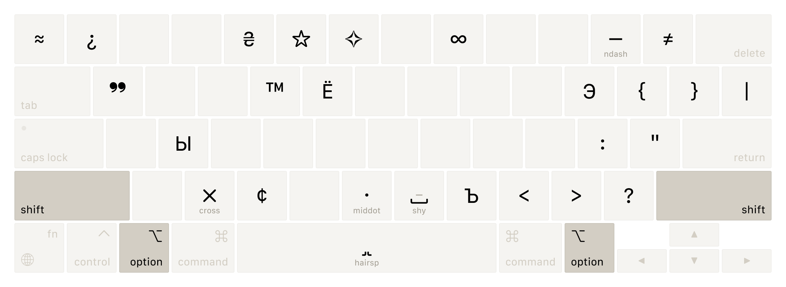

# UABC
Custom keyboard layout combining Ukrainian and English languages with Caps Lock switching for macOS.


<details>
<summary>&nbsp;🟡&nbsp; Preview layers</summary>



</details>

## Features
* Caps Lock LED indicates current input language.
* Default English ABC layout used as the base layer, default Ukrainian as the Caps Lock one.
* Consistent `Shift` `Number` symbol mapping from English layout across both languages.
* Latin symbols that overlap with Cyrillic letters are accessible via `Option` `Symbol` and `Shift` `Option` `Symbol` combinations, except for `,` `.` `/` which follow familiar Cyrillic layout.
* Enhanced with typography and development-specific symbols.

## Installation
1. Download `UABC-X.X.zip` and extract its contents.
2. Move `UABC-X.X.bundle` to one of these locations:
<br />    `~/Library/Keyboard Layouts` for current user, recommended;
<br />    `/Library/Keyboard Layouts` for all users, macOS Sierra or earlier.
3. Open `System Settings > Keyboard > Input Sources`, press `+` button and add UABC layout from English section.
4. Log out and back in for the layout to work properly.

## Usage Tips
1. Reduce Caps Lock button press delay by installing [CapsLockNoDelay](https://github.com/gkpln3/CapsLockNoDelay).
2. Remove blue Caps Lock cursor indicator by running the terminal command and rebooting the system:
```
sudo defaults write /Library/Preferences/FeatureFlags/Domain/UIKit.plist redesigned_text_cursor -dict-add Enabled -bool NO
```

## Known Issues
* Some applications use `Option` `Key` or `Shift` `Option` `Key` combinations as shortcuts. If you encounter conflicts, temporarily switch to another app to input the desired character, then copy and paste it back.
* CleanShot's custom shortcut engine uses Caps Lock letters by default, causing some key combinations to fail. Switch to another keyboard layout when using CleanShot shortcuts.
